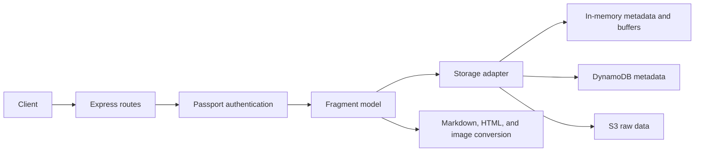

# Fragments

An authenticated REST API for storing small pieces of text, JSON, and image data and retrieving them in supported output formats. The service combines an Express API, owner-scoped access, content conversion, and interchangeable in-memory or AWS storage. It includes automated unit and HTTP integration tests and container delivery workflows for Docker Hub and Amazon ECS.

A **fragment** is a raw data buffer plus metadata: a UUID `id`, an `ownerId` derived from the user's email, `created` and `updated` timestamps, the original content `type`, and its byte `size`. For example, a user can save a Markdown note, retrieve its original source, or request an HTML rendering without modifying the stored fragment.

## Features and technology

- Create, list, retrieve, update, and delete fragments belonging to the authenticated user.
- Retrieve original data, metadata, or a converted representation through separate endpoints.
- Accept supported request bodies up to 5 MB and preserve the original Content-Type, including charset parameters.
- Verify Amazon Cognito ID tokens through Passport and `aws-jwt-verify`; use HTTP Basic Auth for local development and tests.
- Store metadata in DynamoDB and raw data in S3, or use process-local memory without AWS.
- Convert Markdown with `markdown-it`, HTML with `html-to-text`, and images with `sharp`.
- Use Node.js, Express 5, AWS SDK v3, Pino logging, Helmet, CORS, and response compression.
- Validate with ESLint, Jest/Supertest, Hurl, Hadolint, Docker Compose, DynamoDB Local, and MiniStack S3.

## Content types and transformations

Original data can be retrieved for every accepted type. Conversion requests append an extension to the fragment URL; extensions are case-insensitive.

| Stored Content-Type                                  | Supported output extensions                        |
| ---------------------------------------------------- | -------------------------------------------------- |
| `text/plain`                                         | `.txt`                                             |
| `text/markdown`                                      | `.md`, `.html`, `.txt`                             |
| `text/html`                                          | `.html`, `.txt`                                    |
| `application/json`                                   | `.json`, `.txt`                                    |
| `image/png`, `image/jpeg`, `image/webp`, `image/gif` | `.png`, `.jpg`, `.jpeg`, `.webp`, `.gif`           |
| Other `text/*` types, such as `text/css`             | Original data only; no extension-based conversions |

JSON-to-text returns the stored JSON text. Markdown-to-text renders HTML before extracting text. Unsupported or failed conversions return HTTP `415`. Conversion results are generated on demand and are not persisted.

## API and storage architecture



All `/v1` routes require authentication. The public `/` endpoint reports process health and package information; it does not probe storage availability.

The authentication middleware hashes the verified email with SHA-256 to obtain an owner ID. Reads, updates, conversions, and deletes use that owner ID together with the fragment ID, so requests cannot select another owner's storage partition.

When `AWS_REGION` is set, the service selects the AWS adapter:

- **DynamoDB:** metadata items use string partition key `ownerId` and string sort key `id`. Owner-scoped queries return fragment IDs or expanded metadata.
- **S3:** fragment buffers are stored under object keys of the form `ownerId/id`.
- **Credentials:** the SDK uses explicitly configured environment credentials when supplied, including an optional session token, or its default credential provider chain. ECS deployments should use the task role.

Without `AWS_REGION`, separate in-memory stores hold metadata and buffers. Data is lost on process restart and is not shared between instances. S3 and DynamoDB endpoint overrides support local emulation without changing the adapter.

## REST API

| Method   | Endpoint                 | Successful response                     |
| -------- | ------------------------ | --------------------------------------- |
| `GET`    | `/`                      | `200`: public health response           |
| `POST`   | `/v1/fragments`          | `201`: metadata and a `Location` header |
| `GET`    | `/v1/fragments`          | `200`: current user's fragment IDs      |
| `GET`    | `/v1/fragments?expand=1` | `200`: current user's fragment metadata |
| `GET`    | `/v1/fragments/:id`      | `200`: original fragment data           |
| `GET`    | `/v1/fragments/:id/info` | `200`: fragment metadata                |
| `GET`    | `/v1/fragments/:id.:ext` | `200`: requested representation         |
| `PUT`    | `/v1/fragments/:id`      | `200`: updated metadata                 |
| `DELETE` | `/v1/fragments/:id`      | `200`: success response                 |

Metadata and list responses use a JSON envelope with `status: "ok"`; API errors use `status: "error"` with an error code and message. Data endpoints return the content itself. Missing authentication returns `401`, unknown or inaccessible fragments return `404`, unsupported creation types return `415`, and oversized supported request bodies return `413`.

Updates preserve the ID, owner, creation time, and content type while replacing the data and updating size and modification time. The update Content-Type must match the original header value exactly, including parameters; a mismatch returns `400`.

## Authentication

For Cognito, configure both `AWS_COGNITO_POOL_ID` and `AWS_COGNITO_CLIENT_ID`. Clients supply an **ID token**, with an email claim, in `Authorization: Bearer <id-token>`. The verifier checks the configured pool, client, and token use and caches Cognito public keys. Token acquisition and user registration belong to a separate client application.

For development or tests, set `HTPASSWD_FILE=tests/.htpasswd` and keep `NODE_ENV` outside production. The checked-in password file contains public test identities used by the test suite, including `test-user1@fragments-testing.com` / `test-password1`. These are not production credentials. Configuring both authentication modes is rejected, and Basic Auth is disabled when `NODE_ENV=production`.

## Local development

Install Node.js 24 LTS and npm, then run:

```sh
npm ci
```

Both Docker stages use `node:24-alpine`, and GitHub Actions selects Node.js `24`. The package requires Node.js `>=24` to keep development on the supported runtime baseline. Node.js 24 is the tested release line; the Docker tag receives patch updates within that line.

For in-memory development, create an untracked `.env` in the repository root:

```dotenv
NODE_ENV=development
PORT=8080
API_URL=http://localhost:8080
HTPASSWD_FILE=tests/.htpasswd
FRAGMENTS_LOG_LEVEL=info
```

Leave AWS and Cognito variables unset for this mode, including any inherited from the shell. Start the API with `npm run dev` for source watching or `npm start` for normal execution. `src/index.js` loads `.env`; `npm run dev` does not select a separate environment file. `npm run debug` enables the Node inspector on port `9229` and binds it to all interfaces, so use it only on a trusted local network.

Example using the public local test identity:

```sh
curl -i -u test-user1@fragments-testing.com:test-password1 \
  -H 'Content-Type: text/markdown' \
  --data '# Release Notes' \
  http://localhost:8080/v1/fragments

curl -u test-user1@fragments-testing.com:test-password1 \
  'http://localhost:8080/v1/fragments?expand=1'
```

Use the returned `Location` to retrieve the fragment; append `.html` for HTML or `/info` for metadata. On Windows PowerShell, use `curl.exe` for these curl options and `npm.cmd` if script execution policy blocks `npm.ps1`. The multiline shell examples use POSIX continuation syntax.

## Docker and local AWS emulation

Requirements: a running Docker engine with Compose, AWS CLI, a POSIX shell with curl and grep, and the installed npm development dependencies for Hurl. On Windows, run the shell script using Git Bash or an appropriately configured WSL environment with access to Docker and AWS CLI.

From the repository root:

```sh
docker compose up --build -d
sh ./scripts/local-aws-setup.sh
curl --fail --silent --show-error --retry 30 --retry-connrefused --retry-delay 2 --max-time 5 http://localhost:8080
npm run test:integration
docker compose down
```

Compose runs the API on `localhost:8080`, DynamoDB Local on `localhost:8000`, and MiniStack S3 on `localhost:4566`. The API uses the containers' internal network endpoints. The setup script waits for both emulators, creates a local bucket and metadata table, and waits for the table to become available. Run setup once per fresh stack; creating an existing table may fail. Stop the stack when finished, including after a failed test run.

The default bucket and table name `fragments` is exclusively a local test value. Both Compose and the setup script accept exported `AWS_S3_BUCKET_NAME` and `AWS_DYNAMODB_TABLE_NAME` overrides; export the same values before running both commands. Compose `.env` interpolation alone does not export variables to the setup script.

`AWS_ACCESS_KEY_ID=test` and `AWS_SECRET_ACCESS_KEY=test` are intentionally fake emulator credentials. The setup script clears any inherited session token and directs every AWS CLI operation to localhost. DynamoDB Local runs in memory, and Compose defines no persistent volumes; treat this stack as disposable test storage.

To build the production image separately:

```sh
docker build -t fragments:local .
```

The multi-stage image installs only production dependencies and listens on port `80`. It defaults to production authentication and needs external Cognito configuration; Compose explicitly selects test mode. Real AWS storage also requires the region, storage names, and appropriate credentials or an ECS task role.

## Environment variables

| Variable                                     | Purpose / default                                                                      |
| -------------------------------------------- | -------------------------------------------------------------------------------------- |
| `NODE_ENV`                                   | `production` disables Basic Auth; set by the Docker image                              |
| `PORT`                                       | API listener; defaults to `8080` in code, `80` in the image                            |
| `API_URL`                                    | Base URL for creation `Location` headers; otherwise uses the request protocol and host |
| `FRAGMENTS_LOG_LEVEL`                        | Pino level; defaults to `info`; `silent` in `env.jest`                                 |
| `HTPASSWD_FILE`                              | Password-file path for non-production Basic Auth                                       |
| `AWS_COGNITO_POOL_ID`                        | Cognito user pool for ID-token verification                                            |
| `AWS_COGNITO_CLIENT_ID`                      | Cognito application client for ID-token verification                                   |
| `AWS_REGION`                                 | Selects the AWS adapter and sets the SDK region; unset selects memory                  |
| `AWS_S3_BUCKET_NAME`                         | Existing bucket for fragment data; required for AWS storage                            |
| `AWS_DYNAMODB_TABLE_NAME`                    | Existing metadata table; required for AWS storage                                      |
| `AWS_S3_ENDPOINT_URL`                        | Optional S3 endpoint override for emulation                                            |
| `AWS_DYNAMODB_ENDPOINT_URL`                  | Optional DynamoDB endpoint override for emulation                                      |
| `AWS_ACCESS_KEY_ID`, `AWS_SECRET_ACCESS_KEY` | Optional explicit SDK credentials; use task-role credentials on ECS                    |
| `AWS_SESSION_TOKEN`                          | Optional session token for temporary credentials                                       |

`env.jest` supplies local test settings. Run unit tests with AWS and Cognito variables unset so they select in-memory storage and Basic Auth. Keep deployment values in the deployment environment or GitHub configuration, never in source-controlled environment files.

## Testing

```sh
npm run lint
npm test
npm run coverage
npm audit --omit=dev
npm run test:integration
```

Jest and Supertest exercise the model, memory storage, authentication selection, API lifecycle, user isolation, conversion, response metadata, and error paths. `npm run test:watch` runs Jest in watch mode. Coverage collection enforces an 80% global line threshold; the report reflects instrumented modules and does not establish live AWS or Cognito coverage.

The Hurl integration command discovers all `tests/integration/**/*.hurl` files. Run it against the Compose stack above to exercise S3 and DynamoDB adapters, image conversion, updates, deletes, content types, health checks, and authentication failures. Public Basic Auth credentials are scoped to testing. A production dependency audit is a separate check and can fail even when functional tests pass.

## CI/CD and AWS deployment

`.github/workflows/ci.yml` runs on pushes and pull requests targeting `main`. Separate jobs run ESLint, Hadolint, unit tests, and the Docker/AWS-emulation integration suite. Dependency installation uses `npm ci`. After all checks pass on a push to `main`, the publishing job pushes to `ken2004/fragments` on Docker Hub using commit, `main`, and `latest` tags. The configured Docker Hub credentials must have push access to that repository. Pull requests do not publish images.

`.github/workflows/cd.yml` runs on pushed `v*` tags. It runs the local integration suite, builds and publishes version and `latest` tags to ECR, prepares and renders an ECS task definition, and deploys to an existing ECS service while waiting for stability. It does not create the surrounding AWS infrastructure or rerun every CI job; release tags should point to commits that passed CI.

The committed `fragments-definition.json` is a template for a Linux x86-64 Fargate task using `awsvpc`, 256 CPU units, 512 MiB memory, and container port `80`. It contains no account-specific roles. CD injects role ARNs and CloudWatch logging settings into a temporary task-definition file with `jq`, then renders the ECR image URI and runtime environment. The template must pass through these preparation steps before deployment.

The deployment expects an ECR repository, ECS cluster and service with suitable networking, a Cognito user pool and client, an S3 bucket, a DynamoDB table with the keys described above, and IAM roles. CloudWatch Logs uses the configured log group; automatic group creation is enabled in the template and requires corresponding permissions. This repository does not provision those resources, DNS, TLS termination, or a load balancer.

Configure these **GitHub Actions secrets**:

| Secret                                          | Used for                                                        |
| ----------------------------------------------- | --------------------------------------------------------------- |
| `DOCKERHUB_USERNAME`, `DOCKERHUB_TOKEN`         | CI image publishing                                             |
| `AWS_ACCESS_KEY_ID`, `AWS_SECRET_ACCESS_KEY`    | CD access to ECR and ECS                                        |
| `AWS_SESSION_TOKEN`                             | Optional, when CD credentials are temporary                     |
| `AWS_ECS_TASK_ROLE_ARN`                         | Required task role for the application's S3 and DynamoDB access |
| `AWS_ECS_EXECUTION_ROLE_ARN`                    | Required execution role for ECS image pulls and logging         |
| `AWS_COGNITO_POOL_ID`, `AWS_COGNITO_CLIENT_ID`  | Deployed authentication configuration                           |
| `AWS_S3_BUCKET_NAME`, `AWS_DYNAMODB_TABLE_NAME` | Deployed storage configuration                                  |
| `API_URL`                                       | Deployed API base URL for `Location` headers                    |

The two ECS role secrets are required by the task-definition preparation step. Missing values cause that step to fail. The deployment identity needs permission to pass these roles to ECS, in addition to its ECR/ECS deployment permissions. Supply role values from your own infrastructure.

Optional **GitHub Actions repository variables** select the deployment target while preserving the workflow's existing defaults:

| Variable         | Default               |
| ---------------- | --------------------- |
| `AWS_REGION`     | `us-east-2`           |
| `ECR_REPOSITORY` | `fragments`           |
| `ECS_CLUSTER`    | `fragments-cluster`   |
| `ECS_SERVICE`    | `fragments-service`   |
| `ECS_LOG_GROUP`  | `/ecs/fragments-task` |

These names are configuration defaults, not claims that resources are provisioned or publicly deployed. The task family and container name are defined by the checked-in template; keep the workflow container name aligned if customizing it.

## Security and current boundaries

- Production uses Cognito ID-token verification and owner-scoped storage. Hashing emails creates stable pseudonymous identifiers; it does not make them anonymous or encrypted.
- Authentication logs omit raw tokens, email addresses, and decoded claims. Pino logs can still contain owner IDs, resource identifiers, and operational errors; handle logs accordingly.
- Helmet is enabled. CORS currently allows all origins and exposes `Location`. Authentication remains required for API access.
- Serve production traffic over HTTPS using infrastructure configured outside this repository. The application itself listens over HTTP.
- Bodies are stored as raw bytes according to the accepted Content-Type. Creation does not validate JSON syntax or image contents; malformed images can fail conversion later. Stored HTML is not sanitized for embedding in a client page.
- No rate limiting, pagination interface, conversion cache, or storage transaction spanning S3 and DynamoDB is implemented. DynamoDB listing currently reads a single query page; partial storage failures can leave metadata and data inconsistent.
- Several handlers map storage failures to `404` or `415`, and general error responses can expose error messages. The public health response includes a hostname and does not demonstrate storage readiness.
- The container retains the base image's default root user. Runtime hardening and ongoing dependency advisory monitoring remain deployment maintenance work.
- Integration tests use local emulators and Basic Auth. They do not validate real Cognito tokens, IAM policies, AWS networking, or a live ECS rollout.

## Repository structure

```text
.github/workflows/        CI checks, image publishing, and ECS deployment
src/auth/                 Passport strategies and owner identity middleware
src/model/fragment.js     Fragment metadata, validation, and lifecycle
src/model/data/aws/       DynamoDB metadata and S3 data adapters
src/model/data/memory/    In-memory storage implementation
src/routes/api/           Versioned REST handlers and conversion
src/app.js                Express application and middleware
src/index.js              Environment loading and startup
src/server.js             HTTP listener
scripts/local-aws-setup.sh Local emulator resource preparation
tests/unit/               Jest and Supertest tests
tests/integration/        Hurl scenarios and image fixture
Dockerfile                Multi-stage production image
docker-compose.yml        API and local AWS emulators
fragments-definition.json Portable ECS task-definition template
```

## Skills demonstrated

REST API design, authentication and resource ownership, binary data handling, content transformation, storage abstraction, AWS SDK integration, container packaging, automated HTTP testing, and CI/CD configuration for ECR/ECS deployment.

Maintained by Harsh Prajapati. Source: [Ken-2004/fragments](https://github.com/Ken-2004/fragments). The package is private and marked `UNLICENSED`.
